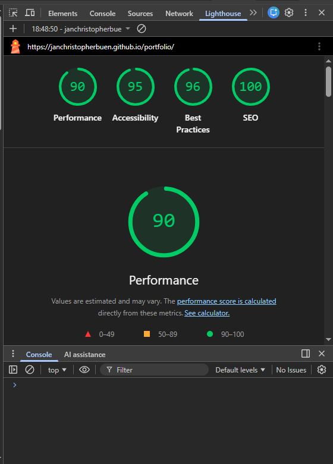
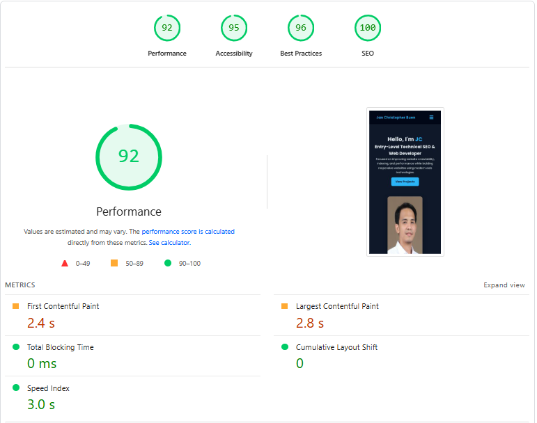
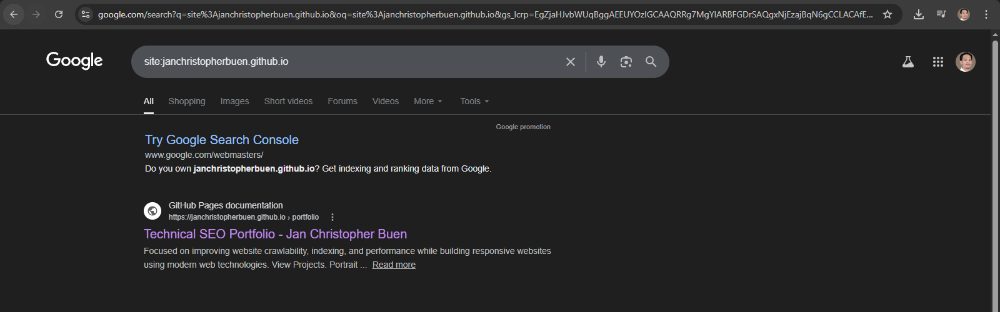
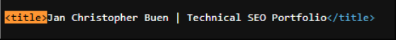
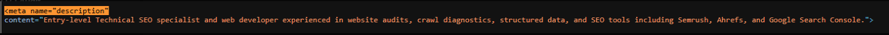
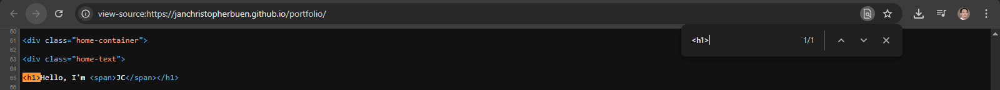
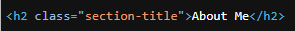
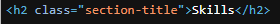

# Technical SEO Audit: Personal Portfolio Website

## 1. Overview

**Website:** https://janchristopherbuen.github.io/portfolio/
**Audit Type:** Technical SEO Audit
**Platform:** GitHub Pages (Static Website)

This audit evaluates the technical SEO performance of a personal portfolio website. The objective is to identify technical issues affecting crawlability, indexing, performance, and search visibility.

The audit includes analysis of:

* Website performance and Core Web Vitals
* Indexability and crawl directives
* HTML metadata
* Heading hierarchy
* Internal linking
* Structured data implementation
* Sitemap and robots configuration

---

# 2. Audit Methodology

The audit followed a structured technical SEO workflow using both automated diagnostic tools and manual source-code inspection.

### Tools Used

| Tool                   | Purpose                               |
| ---------------------- | ------------------------------------- |
| Chrome Lighthouse      | Performance and technical diagnostics |
| PageSpeed Insights     | Core Web Vitals analysis              |
| Google Search Operator | Indexability verification             |
| Schema Validator       | Structured data validation            |
| Manual HTML Inspection | Metadata and heading analysis         |

---

## 2.1 Performance Audit

### Screenshot



### Analysis

The Lighthouse audit shows strong technical performance.

| Category       | Score |
| -------------- | ----- |
| Performance    | 90    |
| Accessibility  | 95    |
| Best Practices | 96    |
| SEO            | 100   |

**Interpretation**

The high scores indicate:

* Efficient front-end architecture
* Lightweight static assets
* Minimal render-blocking resources

Because the site runs on **GitHub Pages static hosting**, it benefits from fast server response times and reduced JavaScript overhead.

---

## 2.2 Core Web Vitals Analysis

### Screenshot



### Metrics

| Metric                   | Result | Target | Status            |
| ------------------------ | ------ | ------ | ----------------- |
| First Contentful Paint   | 2.4s   | <2.5s  | Pass              |
| Largest Contentful Paint | 2.8s   | <2.5s  | Needs Improvement |
| Total Blocking Time      | 0ms    | <200ms | Excellent         |
| Cumulative Layout Shift  | 0      | <0.1   | Excellent         |

### Analysis

The only metric slightly outside Google's optimal threshold is **Largest Contentful Paint (LCP)**.

This likely occurs due to the **hero profile image loading above the fold**.

### Recommendation

* Compress images
* Convert images to WebP format
* Optimize hero image loading

---

## 2.3 Indexability Check

### Screenshot



### Test Method

Google search operator used:

```
site:janchristopherbuen.github.io
```

### Result

The portfolio homepage appears in Google search results, confirming that:

* The page is crawlable
* The page is indexed
* Search engines can access the content

### Analysis

Indexability configuration is correct. No blocking directives were detected.

---

## 2.4 Metadata Inspection

### Screenshot

### Title Tag



### Meta Description



### Analysis

| Element           | Status        |
| ----------------- | ------------- |
| Title Tag         | Optimized     |
| Meta Description  | Slightly long |
| Keyword Targeting | Present       |

### Recommendation

Shorten the meta description to approximately 150–160 characters for optimal search snippet display.

Example optimized description:

```
Technical SEO portfolio showcasing SEO audits, crawl diagnostics, structured data implementation, and website optimization projects.
```

---

## 2.5 Heading Structure Analysis

### Screenshot






### Analysis

The H1 heading does not contain the primary topic keyword **Technical SEO**, which weakens the page's topical relevance.

### Recommended H1

```
Technical SEO Specialist Portfolio – Jan Christopher Buen
```

This improves:

* Topic clarity
* Keyword targeting
* Search relevance signals

---

## 2.6 Internal Linking Analysis

### Screenshot


### Example Links

```
View Project
View Report
```

### Analysis

These anchor texts are generic and provide little contextual meaning for search engines.

Search engines use anchor text to understand the relevance of linked content.

### Recommended Anchor Text

```
Technical SEO Audit Case Study
Indexability SEO Audit Report
Technical SEO Site Architecture Analysis
```

---

## 2.7 Structured Data Validation

### Screenshot


### Schema Type Implemented

```
Person
```

### Validation Result

```
0 Errors
0 Warnings
```

### Analysis

The schema correctly defines the entity representing the website owner.

Example fields included:

* name
* jobTitle
* url
* image
* sameAs
* knowsAbout

This structured data helps search engines understand the entity associated with the portfolio.

---

## 2.8 Robots.txt Configuration

### Screenshot


### robots.txt File

```
User-agent: *
Allow: /

Sitemap: https://janchristopherbuen.github.io/portfolio/sitemap.xml
```

### Analysis

The robots file correctly:

* Allows search engine crawling
* References the XML sitemap

No crawl restrictions were detected.

---

## 2.9 XML Sitemap Analysis

### Screenshot


### Sitemap Entries

```
/portfolio/
/portfolio/certificates.html
```

### Analysis

The sitemap provides search engines with a list of indexable URLs.

This improves:

* crawl efficiency
* content discovery

---

# 3. Issues Identified

| Issue                        | Impact                     | Severity |
| ---------------------------- | -------------------------- | -------- |
| H1 missing keyword           | Weak topical relevance     | Medium   |
| Generic anchor text          | Weak internal link signals | Medium   |
| LCP slightly above threshold | Slower hero content load   | Low      |
| Meta description length      | Possible SERP truncation   | Low      |
| Image filename generic       | Weak image SEO signals     | Low      |

---

# Audit Summary

| Category            | Result    |
| ------------------- | --------- |
| Performance         | Excellent |
| Technical SEO       | Strong    |
| On-Page SEO         | Good      |
| Structured Data     | Excellent |
| Crawl Configuration | Correct   |

**Overall Technical SEO Score**

```
89 / 100
```

The website demonstrates strong technical foundations with minor optimization opportunities related primarily to semantic markup and content signals.

