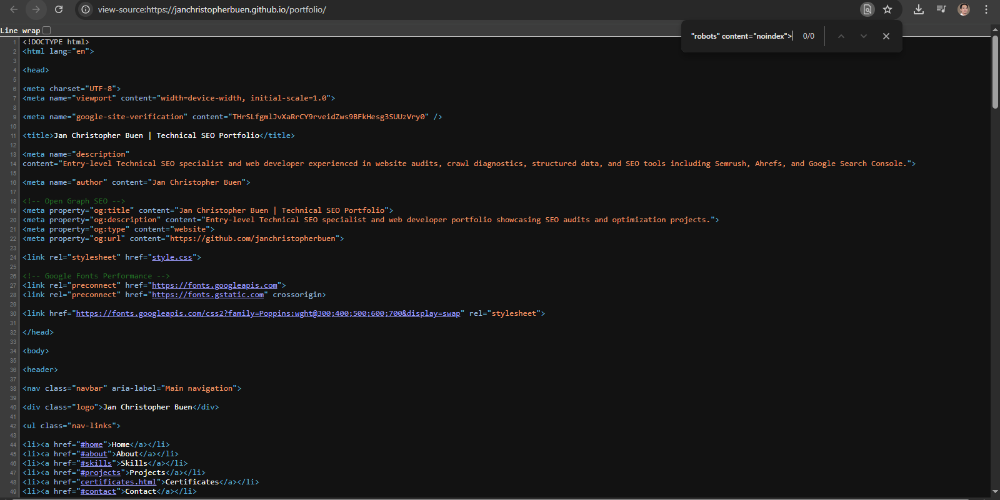
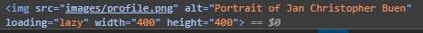
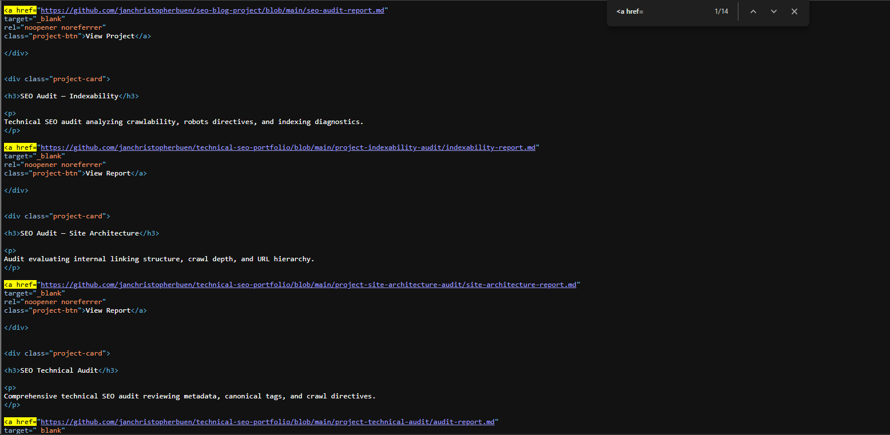
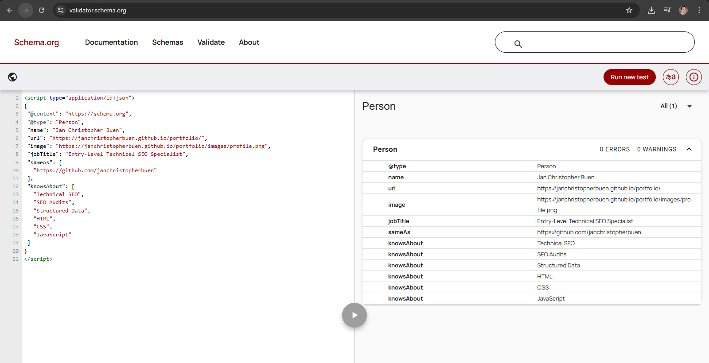
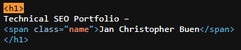
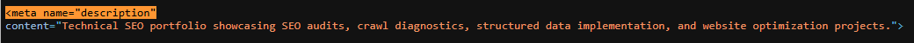
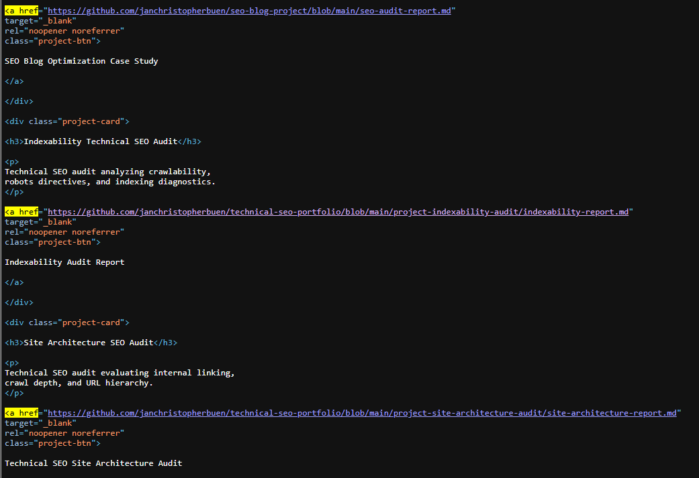

# Technical SEO Audit: Personal Portfolio Website

## 1. Overview

**Website:** https://janchristopherbuen.github.io/portfolio/
**Audit Type:** Technical SEO Audit
**Platform:** GitHub Pages (Static Website)

This audit evaluates the technical SEO configuration of a personal portfolio website developed to showcase technical SEO and web development projects.

The objective of this audit is to analyze technical elements that influence search engine crawling, indexing, and ranking performance.

The audit examines:

* Website performance and Core Web Vitals
* Crawlability and indexability
* HTML metadata
* Heading hierarchy
* Image SEO
* Internal linking
* Structured data implementation
* robots.txt configuration
* XML sitemap structure

---

# 2. Audit Methodology

The website was evaluated using a structured technical SEO process combining automated diagnostic tools and manual source code inspection.

### Tools Used

| Tool                   | Purpose                               |
| ---------------------- | ------------------------------------- |
| Chrome Lighthouse      | Performance and technical diagnostics |
| PageSpeed Insights     | Core Web Vitals testing               |
| Google Search Operator | Indexability verification             |
| Schema Validator       | Structured data validation            |
| Manual HTML Inspection | Metadata and markup analysis          |

---

# 2.1 Performance Audit

### Screenshot


### Results

| Category       | Score |
| -------------- | ----- |
| Performance    | 90    |
| Accessibility  | 95    |
| Best Practices | 96    |
| SEO            | 100   |

### Analysis

The Lighthouse audit shows strong technical performance. The high scores indicate:

* Lightweight static architecture
* Minimal JavaScript overhead
* Optimized CSS delivery
* Efficient resource loading

Because the site is hosted on **GitHub Pages**, it benefits from fast server response times and simplified rendering.

---

# 2.2 Core Web Vitals Analysis

### Screenshot


### Metrics

| Metric                   | Result | Target | Status            |
| ------------------------ | ------ | ------ | ----------------- |
| First Contentful Paint   | 2.4s   | <2.5s  | Pass              |
| Largest Contentful Paint | 2.8s   | <2.5s  | Needs Improvement |
| Total Blocking Time      | 0ms    | <200ms | Excellent         |
| Cumulative Layout Shift  | 0      | <0.1   | Excellent         |

### Analysis

Largest Contentful Paint slightly exceeds Google's recommended threshold.

The likely cause is the **hero image loading above the fold**.

### Recommendation

* Compress hero image
* Convert images to WebP format
* Optimize image delivery

---

# 2.3 Indexability Verification

### Screenshot


### Test Method

Google search operator used:

```
site:janchristopherbuen.github.io
```

### Analysis

Manual inspection of the HTML `<head>` section confirmed that no `noindex` directive is present.

Example metadata found:



### Conclusion

The absence of `noindex` directives confirms that the page is **eligible for indexing by search engines**.

---

# 2.4 Metadata Inspection

### Screenshot


### Title Tag

```
Jan Christopher Buen | Technical SEO Portfolio
```

### Meta Description


### Analysis

| Element           | Status        |
| ----------------- | ------------- |
| Title tag         | Optimized     |
| Meta description  | Slightly long |
| Keyword targeting | Present       |

### Recommendation

Shorten the description to approximately **150–160 characters**.

Example optimized description:

```
Technical SEO portfolio showcasing SEO audits, crawl diagnostics, structured data implementation, and website optimization projects.
```

---

# 2.5 Heading Structure Analysis

### Screenshot


### Current Structure

```
H1: Hello, I'm JC
H2: About Me
H2: Skills
H2: Projects
```

### Analysis

The H1 heading does not contain the primary keyword **Technical SEO**, which weakens topical relevance.

### Recommended H1

```
Technical SEO Specialist Portfolio – Jan Christopher Buen
```

This improves:

* topic clarity
* keyword targeting
* search relevance signals

---

# 2.6 Image SEO Analysis

### Screenshot



### Code Example

```html

```

### Analysis

The image element follows several SEO and performance best practices.

| Factor                   | Status |
| ------------------------ | ------ |
| Alt attribute present    | Yes    |
| Lazy loading enabled     | Yes    |
| Width and height defined | Yes    |
| Layout shift prevention  | Yes    |

### Optimization Opportunity

Current filename:

```
profile.png
```

Recommended filename:

```
jan-christopher-buen-technical-seo-specialist.png
```

This provides stronger relevance signals for image search.

---

# 2.7 Internal Linking Analysis

### Screenshot



### Example Links

```
View Project
View Report
```

### Analysis

The anchor text used for project links is generic and does not provide contextual relevance.

Search engines rely on anchor text to understand the content of linked pages.

### Recommended Anchor Text

Examples:

```
Technical SEO Audit Case Study
Indexability Technical SEO Audit Report
Technical SEO Site Architecture Audit
```

---

# 2.8 Structured Data Validation

### Screenshot



### Schema Type Implemented

```
Person
```

### Validation Result

```
0 Errors
0 Warnings
```

### Example Schema

```json
{
 "@context": "https://schema.org",
 "@type": "Person",
 "name": "Jan Christopher Buen",
 "jobTitle": "Entry-Level Technical SEO Specialist",
 "url": "https://janchristopherbuen.github.io/portfolio/"
}
```

### Analysis

The structured data successfully defines the entity associated with the portfolio website and improves search engine understanding of the website owner.

---

# 2.9 Robots.txt Analysis

### Screenshot


### robots.txt

```
User-agent: *
Allow: /

Sitemap: https://janchristopherbuen.github.io/portfolio/sitemap.xml
```

### Analysis

The robots file correctly:

* allows search engine crawling
* references the XML sitemap

No crawl restrictions were detected.

---

# 2.10 XML Sitemap Review

### Screenshot


### Sitemap Entries

```
/portfolio/
/portfolio/certificates.html
```

### Analysis

The sitemap provides search engines with a list of indexable URLs, improving crawl efficiency and content discovery.

---

# 3. Issues Identified

| Issue                                  | Impact                             | Severity |
| -------------------------------------- | ---------------------------------- | -------- |
| H1 missing keyword                     | Weak topical relevance             | Medium   |
| Generic anchor text                    | Weak internal linking signals      | Medium   |
| Largest Contentful Paint slightly slow | Slower above-the-fold content load | Low      |
| Meta description length                | Possible SERP truncation           | Low      |
| Image filename generic                 | Weak image SEO signals             | Low      |

---

# Audit Summary

| Category            | Result    |
| ------------------- | --------- |
| Performance         | Excellent |
| Technical SEO       | Strong    |
| On-Page SEO         | Good      |
| Structured Data     | Excellent |
| Crawl Configuration | Correct   |

### Overall Technical SEO Score

```
89 / 100
```

The website demonstrates strong technical foundations with minor opportunities for improvement related primarily to semantic markup and internal linking signals.

# 4. Fix Implementation

Based on the issues identified during the audit, several optimizations were implemented to improve technical SEO signals, semantic clarity, and performance.

---

## 4.1 H1 Heading Optimization

### Issue

The original H1 heading did not contain the primary keyword and did not clearly describe the page topic.

Original heading:


### Implementation

The heading was updated to include the primary keyword **Technical SEO Portfolio** and the website owner's name.

Updated heading:



### Result

This improvement strengthens:

* keyword relevance
* topical clarity
* search engine understanding of the page topic

---

## 4.2 Meta Description Optimization

### Issue

The original meta description exceeded the recommended length of 160 characters, which could lead to truncation in search results.

Original description:


### Implementation

The meta description was shortened and refined to emphasize the core focus of the portfolio.

Updated description:



### Result

This change improves:

* search result readability
* click-through rate potential
* keyword targeting

---

## 4.3 Anchor Text Optimization

### Issue

Project links originally used generic anchor text such as "View Project" or "View Report".

Example:


### Implementation

Anchor text was updated to provide descriptive context about the linked content.

Updated example:



### Result

Improved anchor text provides:

* stronger contextual signals
* better internal linking relevance
* improved content discoverability

---

## 4.4 Image SEO Optimization

### Issue

The original image filename was generic.

Original filename:

```text id="image_before"
profile.png
```

### Implementation

The image filename was updated to include descriptive keywords.

Updated filename:

```text id="image_after"
jan-christopher-buen-technical-seo-specialist.png
```

The image markup remained optimized with alt text and lazy loading.

```html id="image_code"

```

### Result

Benefits include:

* improved image search relevance
* stronger semantic signals
* preserved page performance

---

## 4.5 Canonical Tag Implementation

### Issue

The page originally lacked a canonical tag.

### Implementation

A canonical tag was added within the HTML `<head>` section.

```html id="canonical_fix"
<link rel="canonical"
href="https://janchristopherbuen.github.io/portfolio/">
```

### Result

The canonical tag ensures that search engines recognize the preferred URL for the page and prevents potential duplicate indexing issues.

---

## 4.6 Open Graph URL Correction

### Issue

The Open Graph URL originally referenced the GitHub profile instead of the portfolio page.

Original:

```html id="og_before"
<meta property="og:url" content="https://github.com/janchristopherbuen">
```

### Implementation

Updated Open Graph URL:

```html id="og_after"
<meta property="og:url"
content="https://janchristopherbuen.github.io/portfolio/">
```

### Result

This ensures correct sharing previews when the portfolio link is shared on social platforms.

---

# Implementation Summary

| Optimization                | Status      |
| --------------------------- | ----------- |
| H1 keyword optimization     | Implemented |
| Meta description refinement | Implemented |
| Anchor text improvements    | Implemented |
| Image filename optimization | Implemented |
| Canonical tag added         | Implemented |
| Open Graph URL corrected    | Implemented |

These improvements strengthen both **technical SEO signals and semantic relevance**, contributing to improved search visibility and user experience.

